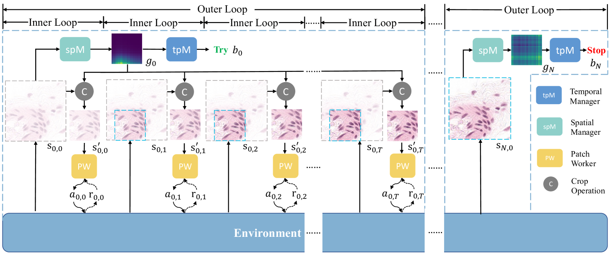

# STAR-RL

This is the implementation of our TMI 2024 [paper](https://ieeexplore.ieee.org/document/10574839):<br>
STAR-RL: Spatial-temporal Hierarchical Reinforcement Learning for Interpretable Pathology Image Super-Resolution



```
@article{chen2024star,
  title={STAR-RL: Spatial-temporal Hierarchical Reinforcement Learning for Interpretable Pathology Image Super-Resolution},
  author={Chen, Wenting and Liu, Jie and Chow, Tommy WS and Yuan, Yixuan},
  journal={IEEE Transactions on Medical Imaging},
  year={2024},
  publisher={IEEE}
}
```

Parts of the code are borrowed from [MRI_RL](https://github.com/wentianli/MRI_RL).

## Environment

I used Python 3.6.1, Pytorch 0.3.1.post2, torchvision 0.2.0, numpy 1.14.2, and tensorboardX 1.7.  
The code usually works fine on my machine with one V100 GPU.

## Data Preparation

For [HistoSR](https://www.dropbox.com/scl/fo/jnn89ik4hhi1s2vja8a5c/AJLNIZzJelR39ExUy5GtT6I?rlkey=h411fmsd65tj26hduf8o5nz89&st=335p2z5i&dl=0) dataset, please download the data and unzip it. (This is the bicubic degradation version. You can degrad the HR image with other degradation.)

Please modify the `data_root` in ./PW/HistoSR/config.py, ./spM_tpW/HistoSR/config.py, and ./spM_tpW/HistoSR/config_tpM.py

## Training

To train the whole framework, we first train patch worker (PW), then train the spatial manager (spM), and finally train the temporal manager (tpM).

### 1. Pre-training patch worker (PW)
```
cd ./PW
sh ./launch/train_pw.sh
```

### 2. Training patch worker (PW) + spatial manager (spM)
```
cd ./spM_tpW
```
To set the directory of pre-trained PW, you need to modify `resume_model` in `spM_tpW/HistoSR/config.py`.
```
sh ./launch/train_spM.sh
```
To evaluate the performance of spM, you can test the model
```
# set the directory of testing model via --model_name xxx_xxx_xxx
sh ./launch/test_spM.sh
```

### 3. Training patch worker (PW) + spatial manager (spM) + temporal manager (tpM)
To set the directory of pre-trained PW and spM, you need to modify `resume_model` for PW and `resume_agent1` for spM in `spM_tpW/HistoSR/config_tpM.py`.
```
sh ./launch/train_tpM.sh
```
To evaluate the performance of tpM, you can test the model
```
# set the directory of testing model via --model_name xxx_xxx_xxx
sh ./launch/test_tpM.sh
```


## Testing
```
cd ./spM_tpW
# set the directory of testing model via --model_name xxx_xxx_xxx
sh ./launch/test_tpM.sh
```

## Contact
If you have any question, please leave the message in issue or email me (wentichen7-c AT my.cityu.edu.hk).